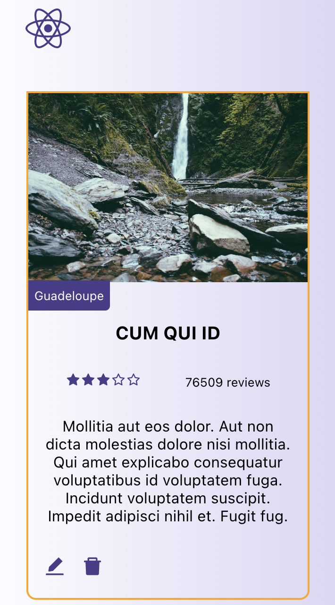
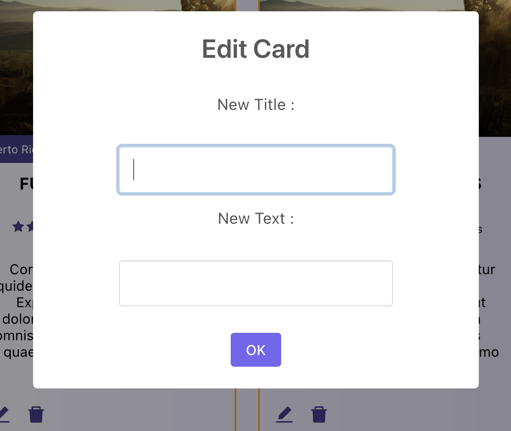

## Patika.dev - Ciceksepeti React Bootcamp Homework 3

You can view a live demo over at 

In this project, I fetch the fake data I created via MockApi.

## Getting Started with Create React App

This project was bootstrapped with [Create React App](https://github.com/facebook/create-react-app).

## Available Scripts

In the project directory, you can run:

### `npm install`

### `npm start`

Runs the app in the development mode.\
Open [http://localhost:3000](http://localhost:3000) to view it in the browser.

The page will reload if you make edits.\
You will also see any lint errors in the console.
# Built With

-HTML

-CSS (SASS)

-JavaScript

-React

-MockApi

-SweetAlert2
